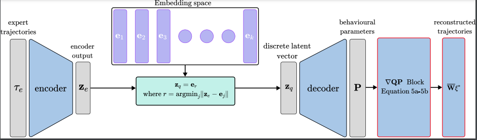
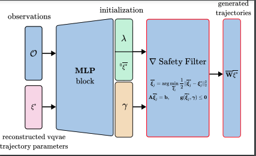
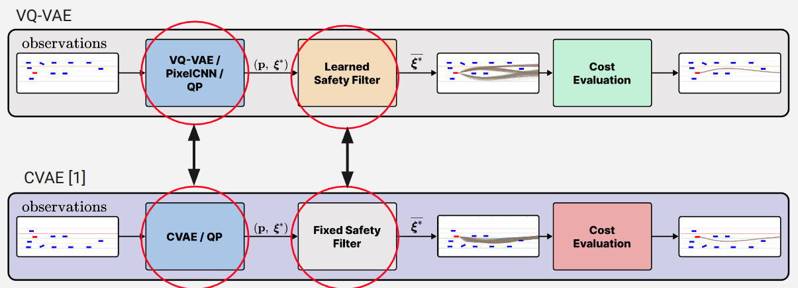
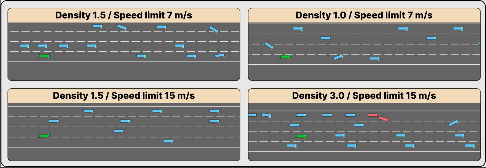
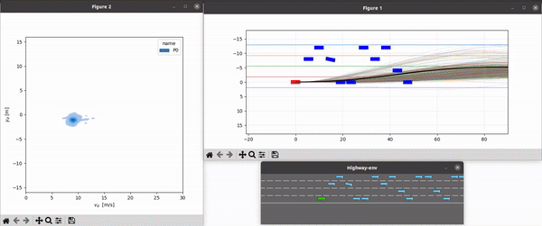

### Learning Sampling Distribution and Safety Filter for Autonomous Driving with VQ-VAE and Differentiable Optimization
This repository contains the source code to reproduce the experiments in our IROS 2024 paper where we compare CVAE based model to VQVAE based model for trajectory planning.

<!-- 
 -->


<!--  -->


Refer to [this repo](https://github.com/jatan12/DiffProj/) for the CVAE baseline used in our comparison.

<!--  -->


## Getting Started

1. Clone this repository:

```
git clone https://github.com/cisimon7/VQOptMain.git
cd VQOptMain
```
2. Create a conda environment and install the dependencies:

```
conda create -n diffproj python=3.8
conda activate diffproj
pip install -r requirements.txt
```

3. Download [Trained Models](https://owncloud.ut.ee/owncloud/s/YgdSoGHgX7maSPc) and save to directory named `weights`

## Reproducing our main experimental results

<!--  -->


#### Running Experiment

Using the main.yaml file, you can configure the environment and optimizer parameters or you can run with the command line args as below:
```
!python3 inferenceJax.py 'env={seed: 42, speed_limit: 15, num_eps: 50, render: False, plot: False}' 'optimizer={maxiter: 100, v_des: 20}' 'batch_size=1000'
```


## Comparison using the simulator

#### VQVAE
<!--  -->


#### CVAE
<!--  -->
